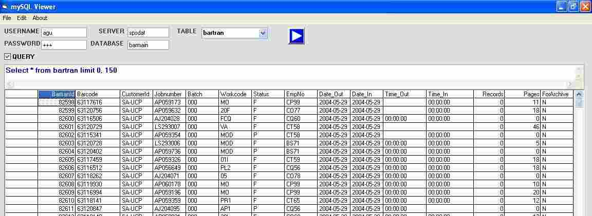

## MySql Viewer using ADO

### Description

Demonstrate the use VB/ ADO to connect to a mySQL server/database / table. Show the records in MSHFlegrid. You can also user sql statement to customize recordset
 
### More Info
 
remote/local server name, username, password, database name, table name

know basic db programming

records in grid

             |
---                |---
**Submitted On**   |2004-09-10 09:43:16
**By**             |[Mark T\. Almen](https://github.com/Planet-Source-Code/PSCIndex/blob/master/ByAuthor/mark-t-almen.md)
**Level**          |Intermediate
**User Rating**    |5.0 (20 globes from 4 users)
**Compatibility**  |VB 3\.0, VB 4\.0 \(16\-bit\), VB 5\.0, VB 6\.0
**Category**       |[Databases/ Data Access/ DAO/ ADO](https://github.com/Planet-Source-Code/PSCIndex/blob/master/ByCategory/databases-data-access-dao-ado__1-6.md)
**World**          |[Visual Basic](https://github.com/Planet-Source-Code/PSCIndex/blob/master/ByWorld/visual-basic.md)
**Archive File**   |[MySql\_View1791609102004\.zip](https://github.com/Planet-Source-Code/mark-t-almen-mysql-viewer-using-ado__1-56098/archive/master.zip)

